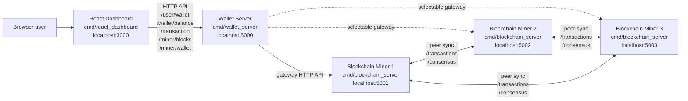
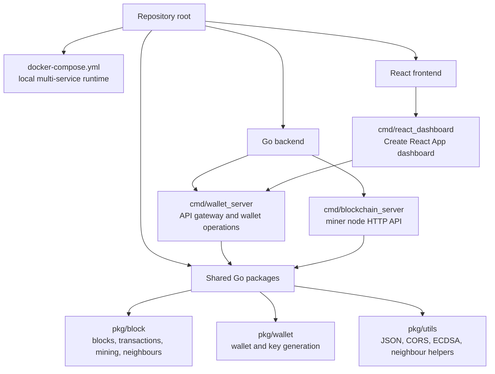
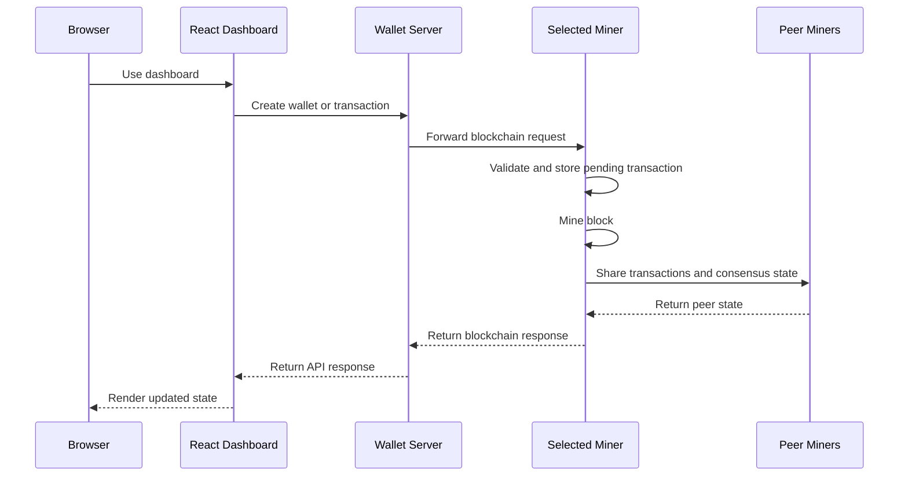

# Project Architecture

This project is currently maintained as a local development blockchain playground. It is not intended to describe or support a production deployment.

## Runtime Components

## Code Organization

## Local Ports

| Component | Default URL |
| --- | --- |
| React dashboard | http://localhost:3000 |
| Wallet server | http://localhost:5000 |
| Miner 1 | http://localhost:5001 |
| Miner 2 | http://localhost:5002 |
| Miner 3 | http://localhost:5003 |

## Request Flow

