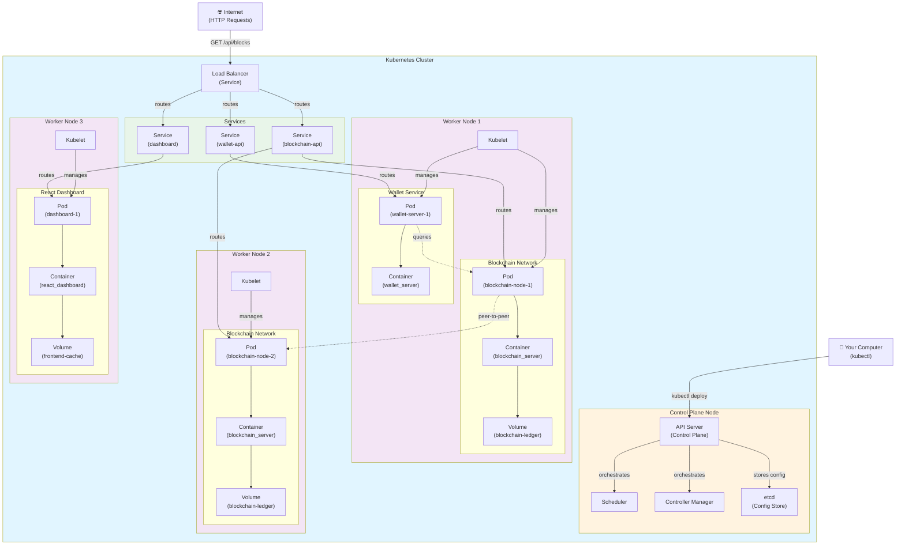

```mermaid
graph TB
    User["👤 Your Computer<br/>(kubectl)"]
    Internet["🌐 Internet<br/>(HTTP Requests)"]
    
    User -->|"kubectl deploy"| APIServer["API Server<br/>(Control Plane)"]
    Internet -->|"GET /api/blocks"| LB["Load Balancer<br/>(Service)"]
    
    subgraph Cluster["Kubernetes Cluster"]
        subgraph ControlPlane["Control Plane Node"]
            APIServer
            Scheduler["Scheduler"]
            ControllerMgr["Controller Manager"]
            ETCD["etcd<br/>(Config Store)"]
        end
        
        subgraph Node1["Worker Node 1"]
            subgraph BCPods["Blockchain Network"]
                Pod1["Pod<br/>(blockchain-node-1)"]
                Container1["Container<br/>(blockchain_server)"]
                Pod1 --> Container1
                Vol1["Volume<br/>(blockchain-ledger)"]
                Container1 --> Vol1
            end
            
            subgraph WalletPods1["Wallet Service"]
                Pod3["Pod<br/>(wallet-server-1)"]
                Container3["Container<br/>(wallet_server)"]
                Pod3 --> Container3
            end
            
            Kubelet1["Kubelet"]
            Kubelet1 -->|manages| Pod1
            Kubelet1 -->|manages| Pod3
        end
        
        subgraph Node2["Worker Node 2"]
            subgraph BCPods2["Blockchain Network"]
                Pod2["Pod<br/>(blockchain-node-2)"]
                Container2["Container<br/>(blockchain_server)"]
                Pod2 --> Container2
                Vol2["Volume<br/>(blockchain-ledger)"]
                Container2 --> Vol2
            end
            
            Kubelet2["Kubelet"]
            Kubelet2 -->|manages| Pod2
        end
        
        subgraph Node3["Worker Node 3"]
            subgraph DashboardPods["React Dashboard"]
                Pod4["Pod<br/>(dashboard-1)"]
                Container4["Container<br/>(react_dashboard)"]
                Pod4 --> Container4
                Vol3["Volume<br/>(frontend-cache)"]
                Container4 --> Vol3
            end
            
            Kubelet3["Kubelet"]
            Kubelet3 -->|manages| Pod4
        end
        
        subgraph Services["Services"]
            BCSvc["Service<br/>(blockchain-api)"]
            WalletSvc["Service<br/>(wallet-api)"]
            DashSvc["Service<br/>(dashboard)"]
        end
        
        APIServer -->|orchestrates| Scheduler
        APIServer -->|orchestrates| ControllerMgr
        APIServer -->|stores config| ETCD
        
        BCSvc -->|routes| Pod1
        BCSvc -->|routes| Pod2
        WalletSvc -->|routes| Pod3
        DashSvc -->|routes| Pod4
        
        LB -->|routes| BCSvc
        LB -->|routes| WalletSvc
        LB -->|routes| DashSvc
        
        Pod1 -.->|peer-to-peer| Pod2
        Pod3 -.->|queries| Pod1
    end
    
    style Cluster fill:#e1f5ff
    style ControlPlane fill:#fff3e0
    style Node1 fill:#f3e5f5
    style Node2 fill:#f3e5f5
    style Node3 fill:#f3e5f5
    style Services fill:#e8f5e9
```
