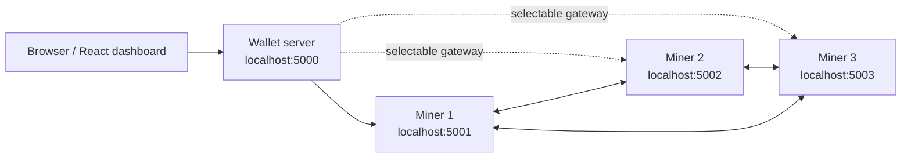

# Project Documentation

This documentation describes the current local-development architecture and code logic of the Go blockchain playground.

The project is a learning-oriented blockchain application, not a production blockchain implementation. It runs a React dashboard, a wallet gateway, and three local miner nodes through Docker Compose.

## Documents

- [Project Architecture](project-architecture.md): runtime components, code ownership, ports, and package boundaries.
- [Backend API](backend-api.md): wallet-server and blockchain-server HTTP endpoints.
- [Domain Logic](domain-logic.md): blocks, transactions, wallets, mining, consensus, and known limitations.
- [Request Flows](request-flows.md): sequence diagrams for wallet creation, transactions, mining, balance reads, and block reads.
- [Operations](operations.md): local run commands, quality checks, e2e flow, environment variables, and debugging notes.

## High-Level Shape

The browser does not talk to miners directly. It talks to the wallet server. The wallet server creates/signs wallet transactions and forwards blockchain operations to the miner requested by each API call. Miners own blockchain state, transaction pools, mining, and peer synchronization.
