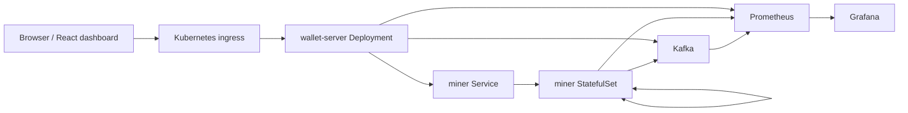

# Distributed Systems Plan

## Goal

Turn the current Docker Compose blockchain playground into a distributed-system learning project that can run on Kubernetes, publish blockchain events through Kafka, and expose useful monitoring signals.

This plan is intentionally incremental. The first target is not a production blockchain. The target is a system where each service has a clear runtime boundary, can be deployed independently, and can be observed while transactions, mining, and consensus activity move through the network.

## Target Architecture



## Phase 1: Runtime Readiness

Prepare the current services for Kubernetes without changing the core blockchain behavior.

- Add health endpoints for wallet and miner services.
- Add readiness checks that confirm each HTTP server can accept traffic.
- Make all service configuration come from environment variables.
- Replace Docker-only peer assumptions with configurable peer discovery.
- Keep the Docker Compose stack working as the local baseline.

Expected outcome: the application can still run locally, but it has the probes and configuration needed for Kubernetes.

## Phase 2: Kubernetes Baseline

Create a local Kubernetes deployment for the existing components.

- Use a namespace such as `go-blockchain`.
- Run `wallet-server` as a Deployment.
- Run the miner nodes as a StatefulSet so each miner has a stable network identity.
- Expose the wallet server through a Service and optional Ingress.
- Expose the dashboard through a Service and optional Ingress.
- Store ports and peer settings in ConfigMaps.
- Keep private material out of ConfigMaps if persistent wallet storage is added later.

Expected outcome: a local cluster can start the dashboard, wallet server, and three miners with stable service names.

## Phase 3: Kafka Event Backbone

Introduce Kafka as an event stream rather than a replacement for the current HTTP API.

Initial event topics:

| Topic | Producer | Consumer | Purpose |
| --- | --- | --- | --- |
| `transactions.created` | wallet server or selected miner | miners, monitoring consumers | Record transaction submissions. |
| `transactions.accepted` | miner | monitoring consumers | Record transaction-pool acceptance. |
| `blocks.mined` | miner | wallet server, monitoring consumers | Record new blocks and mining metadata. |
| `consensus.requested` | miner | monitoring consumers | Record when a node starts conflict resolution. |
| `consensus.resolved` | miner | monitoring consumers | Record whether a node replaced its chain. |

Recommended first implementation:

- Keep HTTP as the command path for wallet creation, transaction submission, mining, balance reads, and block reads.
- Publish Kafka events after successful state changes.
- Use event payloads for auditability and observability, not authoritative consensus at first.
- Add one small consumer later if the project needs derived read models or audit logs.

Expected outcome: the system can show what happened across services without changing user-facing behavior.

## Phase 4: Monitoring and Observability

Add metrics, logs, and dashboards around behavior that matters for a blockchain network.

Prometheus metrics to expose:

| Metric | Type | Owner | Meaning |
| --- | --- | --- | --- |
| `http_requests_total` | counter | wallet, miner | Request volume by route, method, and status. |
| `http_request_duration_seconds` | histogram | wallet, miner | Request latency by route and method. |
| `blockchain_height` | gauge | miner | Current chain length. |
| `transaction_pool_size` | gauge | miner | Pending transactions waiting to be mined. |
| `blocks_mined_total` | counter | miner | Blocks mined by this node. |
| `mining_duration_seconds` | histogram | miner | Time spent mining a block. |
| `consensus_runs_total` | counter | miner | Number of consensus runs. |
| `consensus_replacements_total` | counter | miner | Number of times a chain was replaced. |
| `kafka_events_published_total` | counter | wallet, miner | Events published by topic and status. |

Grafana dashboards should answer:

- Are all wallet and miner pods healthy?
- Which miner has the longest chain?
- Are miners staying in sync?
- How many transactions are pending?
- How long does mining take?
- Are Kafka publishes succeeding?
- Are users seeing HTTP errors or high latency?

Expected outcome: running the demo gives visible feedback about node health, mining, transaction flow, and consensus behavior.

## Phase 5: Resilience and Data

Improve behavior under restarts and partial failure.

- Add persistent storage for blockchain state or explicit snapshot restore behavior.
- Decide whether miner wallets are ephemeral for demos or stored in Secrets.
- Add retry and timeout policies for peer HTTP calls.
- Add Kafka producer retries with bounded backoff.
- Add graceful shutdown for HTTP servers and background mining loops.
- Define what happens when a miner pod restarts and rejoins the network.

Expected outcome: the cluster can tolerate restarts without every demo scenario resetting unexpectedly.

## Kubernetes Resource Plan

Recommended initial manifests:

| Resource | Purpose |
| --- | --- |
| `Namespace` | Isolate the project resources. |
| `ConfigMap` | Store ports, miner count, peer hostnames, dashboard API URL, and Kafka broker address. |
| `Deployment/wallet-server` | Run the dashboard-facing API gateway. |
| `StatefulSet/miner` | Run stable miner identities such as `miner-0`, `miner-1`, and `miner-2`. |
| `Service/wallet-server` | Internal and ingress-facing wallet API endpoint. |
| `Service/miner` | Stable DNS for miner pods. |
| `Deployment/react-dashboard` | Run the browser dashboard. |
| `Service/react-dashboard` | Expose the dashboard inside the cluster. |
| `Ingress` | Optional browser entrypoint for dashboard and API. |
| `Kafka` | Event broker, installed through Helm or an operator for local development. |
| `Prometheus` | Scrape wallet, miner, and Kafka metrics. |
| `Grafana` | Visualize system health and blockchain activity. |

## Suggested Repository Layout

```text
deploy/
  k8s/
    namespace.yaml
    configmap.yaml
    wallet-server.yaml
    miner-statefulset.yaml
    react-dashboard.yaml
    ingress.yaml
  monitoring/
    prometheus-values.yaml
    grafana-dashboard.json
  kafka/
    kafka-values.yaml
```

This keeps deployment artifacts outside application code while making them easy to apply from the repository root.

## Implementation Order

1. Document target environment variables and service names.
2. Add health and metrics endpoints.
3. Create Kubernetes manifests for wallet, miners, and dashboard.
4. Verify the current HTTP flows inside Kubernetes.
5. Install Kafka locally and publish blockchain events after successful state changes.
6. Install Prometheus and Grafana.
7. Add dashboards and alerts for miner health, chain height, mining duration, transaction-pool size, and Kafka publish failures.
8. Add persistence or explicit reset behavior.
9. Add resilience tests for pod restarts, miner loss, Kafka downtime, and delayed peer calls.

## Open Decisions

- Whether miner-to-miner synchronization should stay HTTP-based or move partially to Kafka events.
- Whether Kafka should be required for core behavior or treated as an optional event/audit layer.
- Whether miners should run as a fixed-size StatefulSet or scale dynamically.
- Whether blockchain state should persist across restarts during local demos.
- Whether the dashboard should connect only through the wallet server or also read monitoring-derived status.
