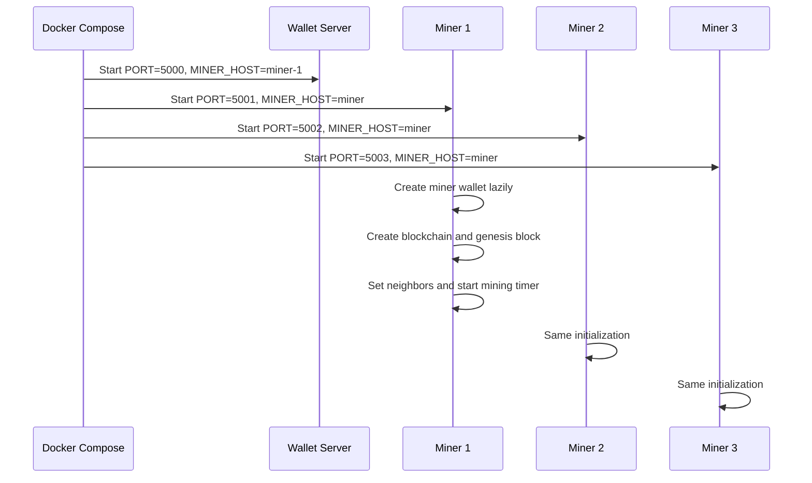
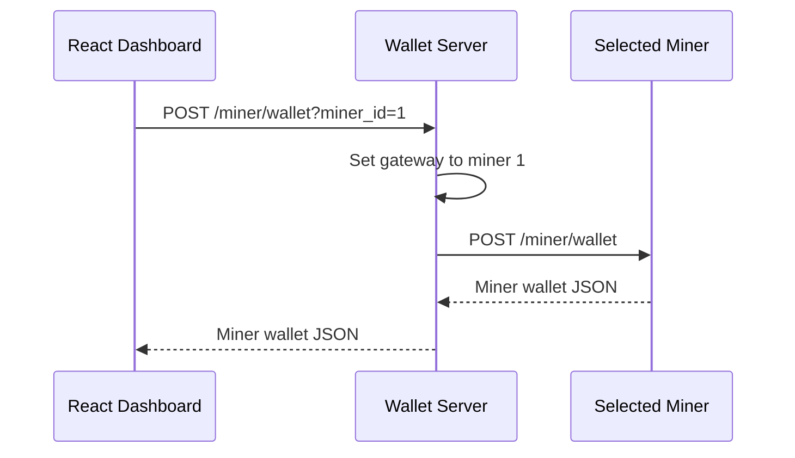
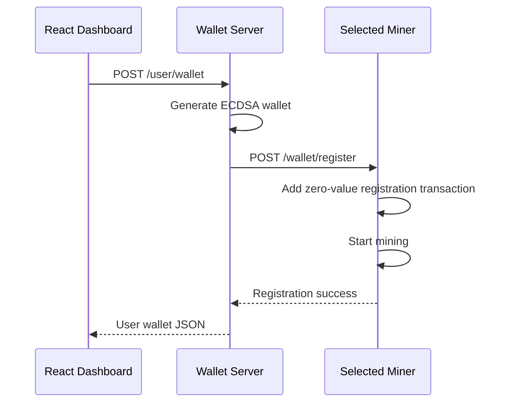
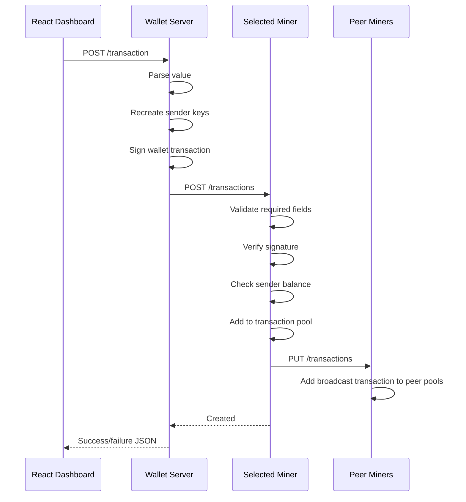
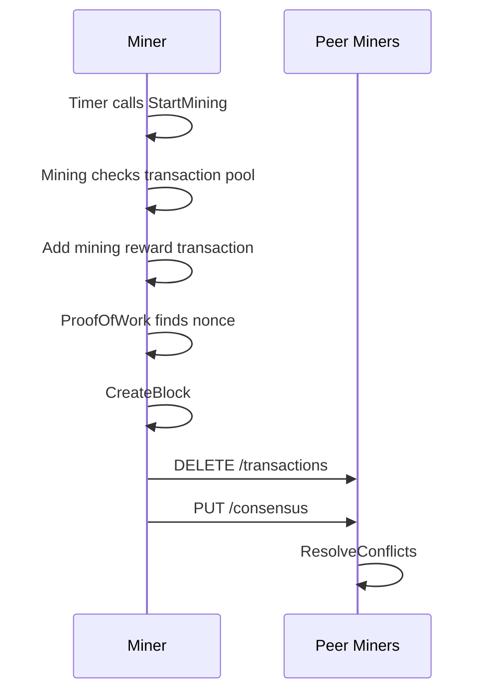
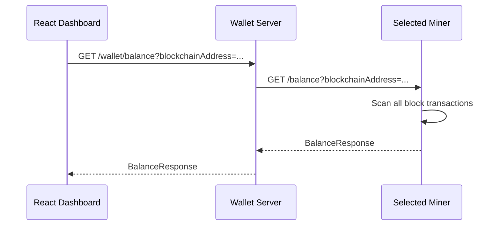
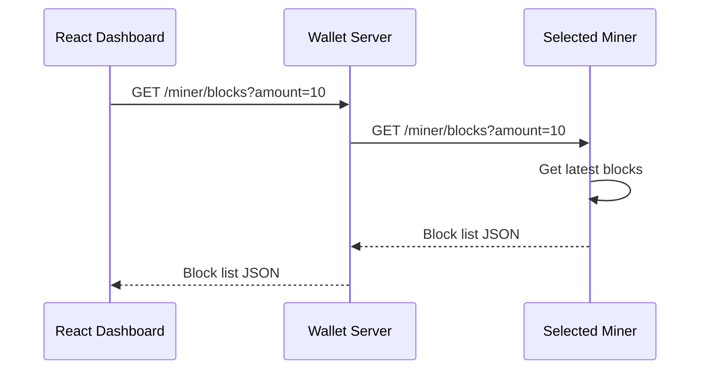
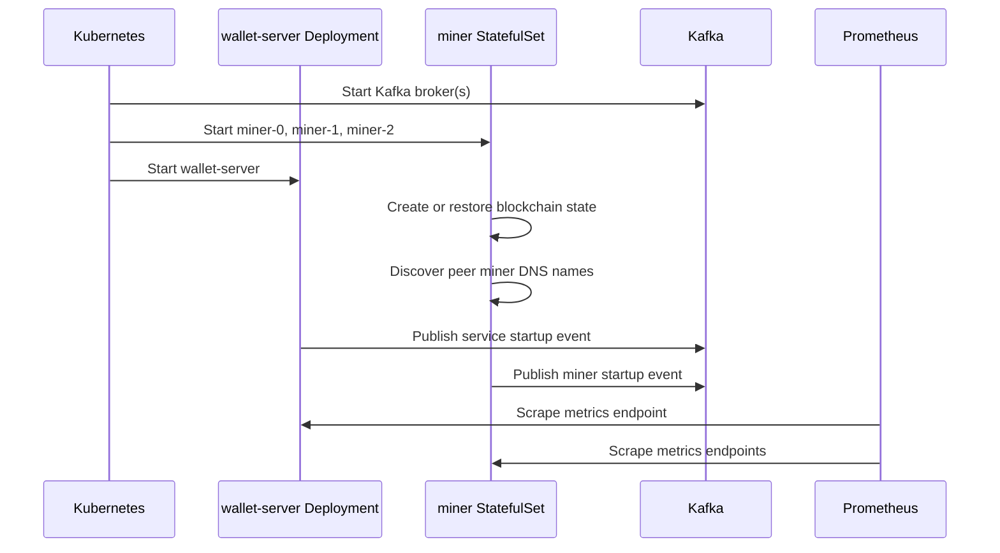
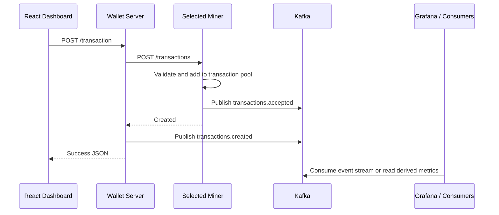

# Request Flows

## Startup

Each miner uses the same binary. Port and Docker service name determine which node it behaves as.

## Miner Wallet Selection

The dashboard includes the selected `miner_id` on later block, balance, and transaction requests.

## User Wallet Creation

The returned user wallet includes private key, public key, and blockchain address.

## Transaction Submission

The transaction is not spendable by the recipient until a miner includes it in a block.

## Mining

Mining returns early if the transaction pool is empty.

## Balance Read

The balance is calculated from chain history only. Pending transaction-pool entries do not count.

## Recent Block Read

The dashboard uses this flow to render recent blockchain activity.

## Planned Kubernetes Startup

In the first distributed version, Kubernetes changes service discovery and runtime management, but the user-facing command path can stay HTTP-based.

## Planned Event Publishing

Kafka should initially describe successful state changes. It should not replace transaction validation, mining, or consensus until the current behavior is stable in Kubernetes.
